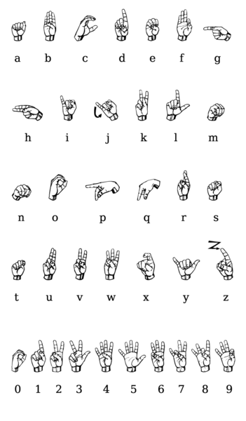
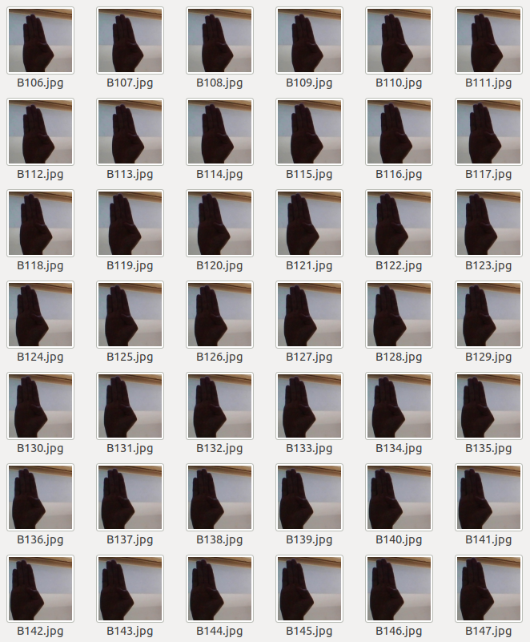
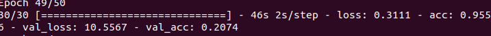
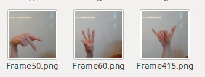

# Using neural nets to transcribe ASL letters

## Capstone Summary
  The goal of this project was to develop a machine learning model capable of reading images of hands making ASL(American Sign Language) letter signs. The goal of such a network would be to develop an application that could directly translate sign language from video into text or perhaps audio. This would serve to make communication easier for deaf or mute people, who otherwise might have to write what they want to say down so that a hearing person would understand them. This would take the onus of translation off of the deaf or mute person, hopefully making their day to day lives a bit easier. It also allows Deaf culture to exist without a need to make it understandable by hearing people.
  For the model itself, I started with a Convolutional Neural Network that I custom built, and fed it data from a kaggle dataset of ASL letters. I would then predict on images taken from video using OpenCV, and output those predictions to the console.
  This resulted in some major errors, so I pivoted to transfer learning and a custom dataset. This led to an incredibly deep rabbit hole, in which I learned quite a bit, but my model could not say the same. From there I attempted to port the program to a flask app, as well as moving back to transfer learning, which gave great success!

### Data
  My original dataset was from Kaggle, consisting of 87,000 images across 29 classes, every letter of the alphabet plus 'space' and 'delete' characters as well as a set of empty backgrounds. This was a pre-arranged dataset, with every class in individual folders, but with a tiny test set. The test set consisted of 29 images, one for each class, and nothing else, making validation somewhat difficult. This led to me augmenting the training set with images I found in another kaggle dataset, as well as images I took myself.
  
  
  
  
  This proved to be my downfall, as I discovered the data was incredibly specialized, and any outside images weren't recognized. My accuracy plummeted from where it was, and a new plan was needed.
### Transfer Learning and Data Augmentation
  I then decided to move to transfer learning and create a new, smaller dataset to predict for actual use cases. This led to an in-depth exploration of OpenCV's video reading and image classification methods,something I had not planned to explore so soon. I developed a script to read a video, take individual frames from said video, and then resize and crop the images before saving them. This allowed me to build a supplementary dataset of ~1200 images that I planned to use with the XCeption model from keras.
  
  The transfer learning began to run into isssues showing that my model was not properly optimized for the images I was using. This led me back to using my old model, and creating my own dataset of ~6000 images to start. I wanted a small baseline to begin with, and this seemed best. I wrote another program that piggybacked off of my earlier program to automatically name and assign images from video, and used my computer webcam to extend my dataset.
### Model
  I ended up using another transfer learning model based off of InceptionV3 when my accuracy on a custom CNN did not improve as much as I had hoped. This resulted in much higher accuracies than before, and even a slightly better training time for similar results. However, this this overfit by a great deal, most likely due to a sparcity of data.
### Results
  My best model accuracy was 49%, with a transfer learning model based off the InceptionV3 model. One of the papers I read in my research used an earlier version of their model for a similar purpose, so it seemed proper to use. The most commonly predicted letters were W, Y, and P, all signs with extended fingers which I found interesting. Interestingly enough, the model was very accurate at recognizing when there was not a sign being made, and even recognized when I was changing from one sign to another, outputting the 'none' character.
  

### For the Future
  I intend to pour more time into coming up with a better model and a larger dataset. I also would like to attempt to use image segmentation to crop just the hands out of the images, allowing for a better analysis. I would also like to expand the data set to more skin types as well as increase the size of the images, for better recognition.
### References

http://cs231n.stanford.edu/reports/2016/pdfs/214_Report.pdf

https://arxiv.org/pdf/1806.02682.pdf

https://www.kaggle.com/grassknoted/asl-alphabet

https://commons.wikimedia.org/wiki/File:Asl_alphabet_gallaudet.png
